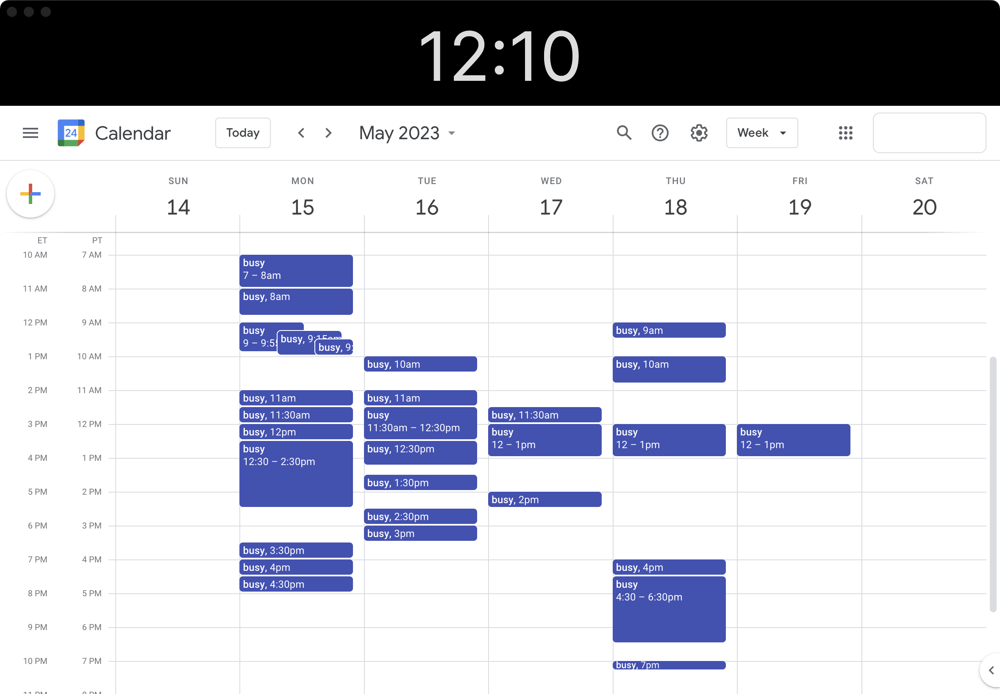

# clock-calendar

A simple Electron app that loads a persistent clock top-bar and Google Calendar for use on a tablet as a separate display.

<p align="center">
    
</p>

This leverages the Electron BrowserView to display a persistent clock on the top and another BrowserView that loads Google Calendar. This is a useful tool for workflow when using a tablet as an external display to have an always-visible calendar with a larger clock help avoid missing meetings. My current workflow has a tablet on a stand between keyboard and primary display to make the calendar and clock easy to view which is especially useful for those with many meetings throughout the day.

### Known Issues

* Right Click on clock immediately crashes Electron and appears to only happen since it is decorated as `-webkit-app-region: drag` style to allow it to drag the app window
* Google auth forces a new window which never returns to the primary electron window - workaround is to restart the app after login

## Project Init & Build

```bash
$ npm init
$ npm install electron --save-dev
# run dev
$ npm run start
# build
$ npm install --save-dev @electron-forge/cli
$ npx electron-forge import
$ npm run make
```